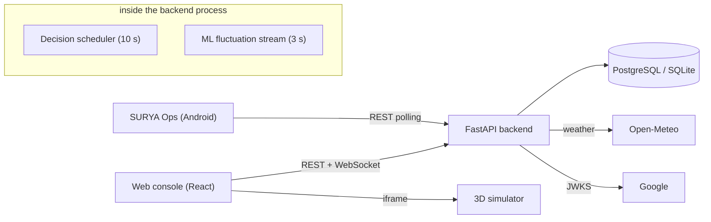

# SURYA: Smart Unified Renewable Yield Automation

SURYA is an energy-management platform for campus microgrids. It keeps a live digital twin of a campus (solar, wind, battery storage, buildings, grid), forecasts renewable generation with ML models driven by live weather, and runs an explainable cost-and-carbon optimiser every few seconds. Results are delivered to a web console, a 3D campus simulator and an Android alerts app.

The reference deployment models **Prestige University, Indore**: 300 kW solar, 120 kW wind, 2 × 125 kW battery units, three buildings and an 11 kV grid feeder. The project was built for the Agnitia Hackathon 2026.

## Problem and objectives

Campus microgrids mix variable renewables, storage and grid supply under time-of-day tariffs and carbon targets. Operators need to know the current state, what is coming, and what action is best and why. SURYA aims to:

- Present one live view of every energy asset and the campus totals.
- Forecast solar, wind and demand with uncertainty bands (P10/P50/P90).
- Choose dispatch strategies that balance cost and carbon (weights 0.6 / 0.4 by default), while protecting critical loads and battery reserves.
- Record every decision with its reasons and the rejected alternatives, for audit.
- Alert operators on their phones.

## Features

| Feature | Status |
| --- | --- |
| Live digital twin API, campus aggregates, WebSocket streaming | ✅ Implemented |
| Explainable dispatch optimisation every 10 s with scored alternatives | ✅ Implemented |
| 48-hour ML forecast (LightGBM / XGBoost quantiles) and live Open-Meteo weather | ⚠️ Partial: real models load only from a local path; deployments use placeholder models ([details](docs/ml-and-forecasting.md)) |
| Battery scheduling, virtual net metering, load-shift advice | ⚠️ Implemented and tested but not invoked at runtime ([details](docs/backend.md#5-services)) |
| Email/password and Google sign-in, admin/operator/viewer roles | ✅ Implemented |
| Emergency stop, settings changes with an audit trail | ✅ Implemented (E-stop state is in memory) |
| CSV / PDF reports | ✅ API; ⚠️ console download buttons currently fail ([details](docs/frontend.md#8-known-defects)) |
| 3D campus simulator (12 campuses, weather and hazard drills) | ✅ Standalone visualisation, embedded in the console |
| SURYA Ops Android app with on-device alert rules and notifications | ✅ Implemented (LAN HTTP) |
| Hardware adapters (REST / Modbus / MQTT) | ⚠️ Implemented and tested, not wired |

> **About the "live" data:** no metering hardware is connected. Live values are generated every 3 s from real weather (Open-Meteo), the forecast model's P50 and small random variation. See [workflows.md](docs/workflows.md#ml-fluctuation-stream-the-source-of-live-values).

## Technology stack

| Layer | Technologies |
| --- | --- |
| Backend | Python 3.11+, FastAPI, Uvicorn, Pydantic v2, SQLAlchemy 2 (async), Alembic, PyJWT, Argon2, ReportLab |
| ML | pandas, NumPy, scikit-learn, LightGBM, XGBoost, joblib |
| Database | PostgreSQL (asyncpg) in production; SQLite (aiosqlite) for development and tests |
| Web console | React 18, TypeScript, Vite 5, Tailwind CSS 3, framer-motion, GSAP, Lenis, lucide-react |
| Simulator | React 19, three.js, @react-three/fiber, @react-three/drei, Vite 8 |
| Mobile | React 19, Capacitor 8 (Android), Vite 8 |
| Infrastructure | Render (backend and Postgres), Vercel (console), Docker Compose with nginx (self-hosted) |
| Integrations | Open-Meteo (weather), Google Identity Services, wttr.in (simulator weather) |

## Architecture



Full description: [docs/architecture.md](docs/architecture.md).

## Repository structure

```text
backend/      FastAPI app: api/ routes, services/ (optimisers, scheduler, ML), models/, db/ (migrations, seed), ws/, adapters/
frontend/     React web console (src/pages, components, context, services)
simulator/    3D campus simulator (built into frontend/public/simulator)
mobile/       SURYA Ops Android app (Capacitor)
training/     Offline ML training scripts
tests/backend/  pytest suite
docs/         Documentation
nginx/        nginx config for the Docker frontend
render.yaml, vercel.json, docker-compose.yml, alembic.ini, requirements.txt, pyproject.toml
spec.md, PLAN.md  Original specification and plan (historical)
```

## Quick start

**Prerequisites:** Python 3.11 or 3.12, Node.js 22, Git. Details: [docs/installation-and-setup.md](docs/installation-and-setup.md).

```bash
git clone https://github.com/rasesh13/Agnitia-hack-it.git
cd Agnitia-hack-it

# Backend (from the repository root)
python -m venv .venv
source .venv/bin/activate            # Windows: .venv\Scripts\Activate.ps1
pip install -r requirements.txt
cp .env.example .env                 # set JWT_SECRET_KEY; defaults use SQLite
uvicorn backend.main:app --reload --port 8000
# → http://127.0.0.1:8000/docs   (development mode creates tables and seeds the demo campus)

# Web console (second terminal)
cd frontend
npm ci
npm run build:simulator              # optional: 3D view for the Digital Twin tab
npm run dev                          # → http://localhost:5173 (proxies /api and /ws to :8000)
```

**Environment:** see [docs/environment-configuration.md](docs/environment-configuration.md). Many variables in `.env.example` are validated at startup but not used at runtime.

**Database:** SQLite needs no setup. For PostgreSQL, set `DATABASE_URL` and run `alembic upgrade head` ([docs/database.md](docs/database.md)).

### Production builds

```bash
npm --prefix frontend run build:simulator && npm --prefix frontend run build   # → frontend/dist
alembic upgrade head && uvicorn backend.main:app --host 0.0.0.0 --port $PORT   # single worker
```

### Tests

```bash
python -m pytest                     # backend
python -m ruff check backend tests   # lint
npm --prefix frontend run lint
npm --prefix simulator test
```

Current results, including known failures, are in [docs/testing.md](docs/testing.md).

## Deployment

- **Backend and Postgres:** Render blueprint (`render.yaml`).
- **Web console:** Vercel (`vercel.json`); set `VITE_API_URL` to the backend URL.
- **Self-hosted:** `docker compose up --build`. Read the known issues first.

See [docs/deployment.md](docs/deployment.md). Run the backend with **one worker**: the scheduler, WebSocket hub and emergency-stop state are held in process memory.

The configuration references `https://surya-sim.vercel.app` as the console origin. Its availability was not verified while writing this documentation.

## Security

Read [docs/security.md](docs/security.md) before deploying. In brief:

- Demo admin credentials are in the public source and are seeded when `SEED_DEMO_DATA=true`.
- Several ML and forecast routes that change state are unauthenticated.
- A hard-coded email address is promoted to admin on Google sign-in.

## Known limitations

See [docs/limitations-and-roadmap.md](docs/limitations-and-roadmap.md) for the full list of partial features, verified defects and the proposed roadmap.

## Documentation

The full index is at **[docs/README.md](docs/README.md)**:

- [Architecture](docs/architecture.md) · [Backend](docs/backend.md) · [Frontend](docs/frontend.md) · [API reference](docs/api-reference.md) · [Database](docs/database.md)
- [Auth](docs/authentication-and-authorization.md) · [Security](docs/security.md) · [Deployment](docs/deployment.md) · [Testing](docs/testing.md) · [Troubleshooting](docs/troubleshooting.md)
- [ML & forecasting](docs/ml-and-forecasting.md) · [Simulator](docs/simulator.md) · [Mobile app](docs/mobile-app.md) · [User guide](docs/user-guide.md) · [Contributing](docs/contributing.md)

## Contributing

See [docs/contributing.md](docs/contributing.md) for the workflow, coding conventions, how to add endpoints, pages and entities, and the review checklist.

## License

There is no `LICENSE` file in the repository. The previous README stated: "Proprietary and Confidential. Developed for Agnitia Hackathon 2026." Ask the repository owner before reusing the code.
