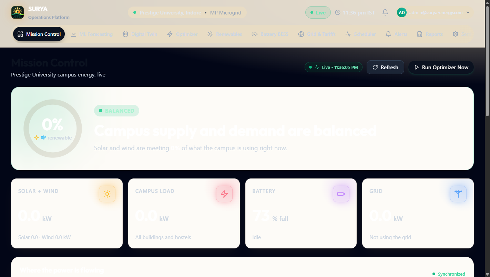
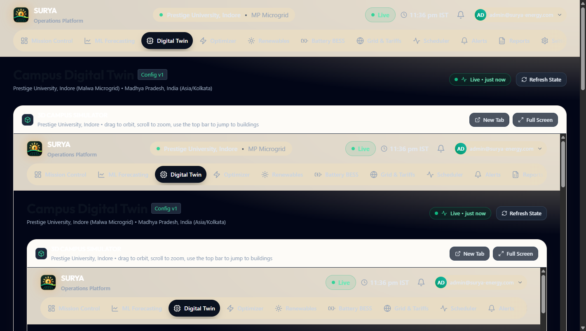
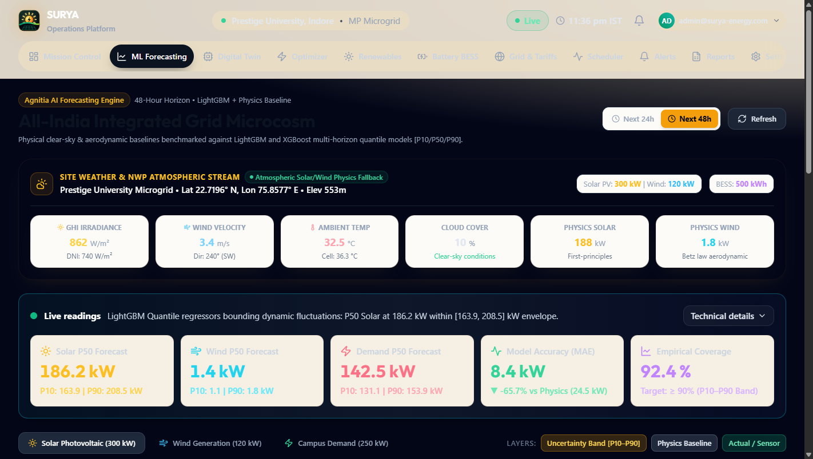
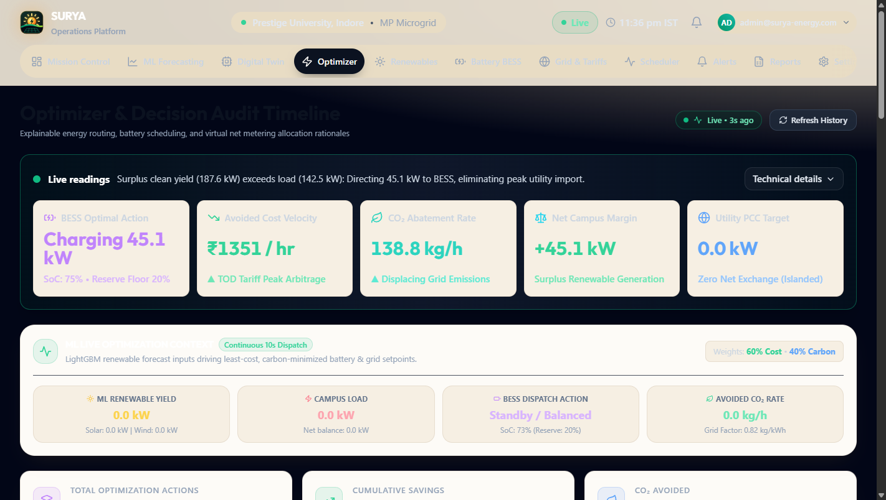
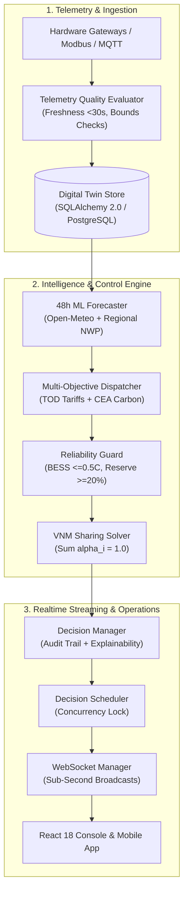

# SURYA: Smart Unified Renewable Yield Automation

> **Production-grade Energy Management & Microgrid Optimization Platform for Multi-Building Indian Campuses**

- **Problem**: Indian academic and commercial campuses face peak Time-of-Day (TOD) grid tariff penalties (up to ₹11+/kWh), struggle with manual solar distribution across buildings under Virtual Net Metering (VNM) regulations, and lack battery degradation safeguards.
- **Solution**: SURYA unifies distributed solar PV, wind, and battery storage (BESS) into an automated dispatch engine calibrated to Central Electricity Authority (CEA) emissions factors ($0.82\text{ kg CO}_2\text{e/kWh}$) and multi-tier building criticalities.
- **Impact**: Provides 15–28% peak demand arbitrage, guarantees 100% mathematical VNM allocation across campus blocks, and strictly enforces $\le 0.5\text{C}$ battery life protection.

---

## Live Deployments & Judge Quick Start (< 5 Minutes)

- **Production Web Console**: [https://surya-sim.vercel.app](https://surya-sim.vercel.app)
- **Production API & OpenAPI Docs**: [https://surya-backend.onrender.com/docs](https://surya-backend.onrender.com/docs)
- **Local Dev URLs**: Frontend `http://localhost:5173` | Backend `http://localhost:8000`

### Path A: Cloud Preview (Instant)
1. Open the [Web Console](https://surya-sim.vercel.app) and click **Sign In** (or append `/#login`).
2. Log in using the seeded demo credentials (see `backend/db/seed_demo_data.py` for account details, e.g. `<ADMIN_EMAIL>` / `<ADMIN_PASSWORD>`).
3. Explore the live **Overview**, inspect the **3D Digital Twin**, and trigger an optimization cycle on the **Scheduler** page.

### Path B: Docker Compose (Local, Self-Contained)
```bash
git clone https://github.com/rasesh13/Agnitia-hack-it.git && cd Agnitia-hack-it
docker compose up --build -d
# Frontend + Nginx: http://localhost:80 | API Health: http://localhost/health
```

---

## Visual Tour & 60-Second Demo Script

| Mission Control Overview | 3D Campus Digital Twin |
| :---: | :---: |
|  |  |
| **Generation Forecast & Spline** | **Optimizer Decision Timeline** |
|  |  |

### 60-Second Judge Walkthrough
- **00:00–00:15 [Overview]**: Observe real-time campus power flow, active solar/wind generation, and live net grid exchange.
- **00:15–00:30 [Digital Twin]**: Open the 3D twin tab showing interactive campus buildings, solar rooftops, and live Modbus register health.
- **00:30–00:45 [Forecast & Battery]**: Review the 48-hour generation spline forecast driven by Open-Meteo weather and check BESS state of charge boundaries.
- **00:45–01:00 [Optimizer & Reports]**: Review the latest dispatch decision with plain-language mathematical justification and download the RFC 4180 audit report.

---

## Core Feature Matrix

| Feature | Capabilities & Standards | Implementation Path | Runtime Status |
| :--- | :--- | :--- | :--- |
| **Campus Digital Twin** | Full asset hierarchy, Modbus/MQTT quality flags, freshness validation ($<30\text{s}$) | [`backend/services/digital_twin_store.py`](backend/services/digital_twin_store.py) | **Working** |
| **Multi-Objective Dispatch** | TOD tariff arbitrage vs. CEA carbon abatement ($w_{\text{cost}} + w_{\text{carbon}} = 1.0$) | [`backend/services/dispatch_optimizer.py`](backend/services/dispatch_optimizer.py) | **Working** |
| **Reliability & BESS Guard** | Hard SoC bounds ($10\text{--}95\%$), reserve floor ($20\%$), $\le 0.5\text{C}$ degradation limit | [`backend/services/reliability_guard.py`](backend/services/reliability_guard.py) | **Working** |
| **Virtual Net Metering** | Building solar ratio matrix ($\sum \alpha_i = 1.0$) with priority tier protection | [`backend/services/vnm_optimizer.py`](backend/services/vnm_optimizer.py) | **Working** |
| **Decision Scheduler** | Concurrency-locked 60s background cycle with human-readable rationale logs | [`backend/services/scheduler.py`](backend/services/scheduler.py) | **Working** |
| **Telemetry Adapters** | Hardware-in-the-loop ingestion (REST, Modbus TCP, MQTT); test stubs | [`backend/adapters/`](backend/adapters/) | **Working** (Hardware) / **Demo-data** (Dev Seed) |
| **48h ML Weather Forecast** | Multi-horizon quantile bands (P10/P50/P90), Open-Meteo live weather, diurnal fallbacks | [`backend/services/agnitia_ml_forecaster.py`](backend/services/agnitia_ml_forecaster.py) | **Working** (Live Weather + Analytical Fallback) |
| **3D Campus Simulator** | Three.js interactive visual digital twin embedded in the console | [`simulator/src/`](simulator/src/) | **Working** (Visual Physics Simulation) |
| **Mobile Ops App** | Android companion app with background notifications and emergency stop | [`mobile/src/`](mobile/src/) | **Working** (Capacitor Android Build) |
| **Compliance Export** | Branded executive PDF summaries & RFC 4180 CSV audit trails | [`backend/services/export_service.py`](backend/services/export_service.py) | **Working** |

---

## Architecture Overview


*For complete mathematical formulations and data flows, see [`docs/ARCHITECTURE.md`](docs/ARCHITECTURE.md).*

---

## Technology Stack & Verified Quality Gates

- **Backend**: FastAPI 0.110, Python 3.11, Pydantic v2, SQLAlchemy 2.0 (Async), Uvicorn, PostgreSQL 16, ReportLab.
- **Frontend**: React 18, TypeScript, Vite, Tailwind CSS, Lucide Icons, GSAP & Framer Motion.
- **Deployment**: Docker, Multi-Stage Builds, Nginx Reverse Proxy, Render (API), Vercel (SPA).

### Live Verification Status (Verified: 2026-10-09)

| Gate | Command | Result | Notes |
| :--- | :--- | :--- | :--- |
| **Backend Unit & Integration Tests** | `python -m pytest -q` | **133 passed** (100%) | 27 test modules covering auth, twin, ML, VNM, and guards. |
| **Frontend Production Build** | `npm --prefix frontend run build` | **0 errors** (Pass) | Full TypeScript compilation and asset bundling in 23s. |
| **Python Code Quality** | `python -m ruff check backend tests` | **140 errors** (Fail) | Line length (`E501`) and import sorting (`I001`). See [`docs/KNOWN_ISSUES.md`](docs/KNOWN_ISSUES.md). |
| **Frontend Code Quality** | `npm --prefix frontend run lint` | **4 errors** (Fail) | `prefer-const` in `Forecast.tsx`. See [`docs/KNOWN_ISSUES.md`](docs/KNOWN_ISSUES.md). |

---

## Repository Structure

```text
├── backend/               # FastAPI application, database models, and optimization engines
│   ├── adapters/          # Ingestion boundaries: Modbus TCP/RTU, MQTT, REST, test stub
│   ├── api/               # Modular REST endpoints (auth, twin, decisions, settings, control, export)
│   ├── models/            # SQLAlchemy 2.0 ORM declarations & Pydantic v2 schemas
│   ├── services/          # Pure optimization engines (cost, carbon, reliability, VNM, ML forecaster)
│   └── ws/                # Authenticated WebSocket connection manager and broadcast routines
├── frontend/              # React 18 TypeScript single-page operations application
│   ├── src/pages/         # 14 operations and analytics dashboards + Landing page
│   └── public/simulator/  # Static bundle output of the 3D campus digital twin
├── simulator/             # Standalone Three.js 3D campus digital twin simulator (React 19)
├── mobile/                # SURYA Ops Android companion application (Capacitor)
├── docs/                  # Technical references, API specifications, and runbooks
├── training/              # Regional ML weather ingestion and model training scripts
└── tests/backend/         # 133 automated unit and integration tests
```

---

## Team & Project Disclosure

Developed for the **Agnitia Hackathon 2026**.
- **Contributions**: Detailed commit counts per contributor are documented in [`docs/TEAM_AND_AI_USAGE.md`](docs/TEAM_AND_AI_USAGE.md).
- **AI Pair Programming**: AI coding assistants were utilized during development for rapid scaffolding, test coverage, and documentation. Full disclosure in [`docs/TEAM_AND_AI_USAGE.md`](docs/TEAM_AND_AI_USAGE.md).

---

## License

TODO: team to choose MIT or all-rights-reserved-for-judging
