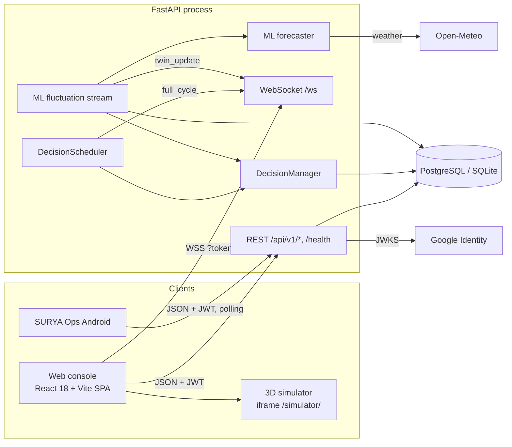
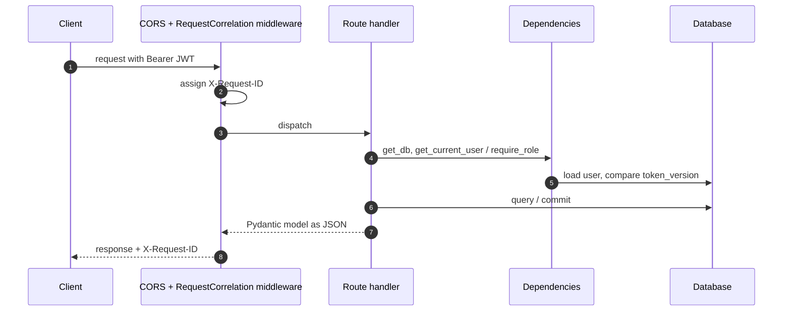
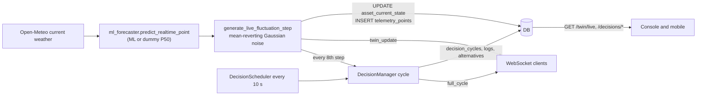
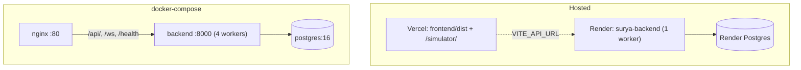

# System Architecture

This document describes how SURYA is put together **as implemented today**. Where the code differs from the original design in `spec.md` and `PLAN.md`, this document follows the code. Proposed improvements are kept separate, in [limitations-and-roadmap.md](limitations-and-roadmap.md).

Related: [backend.md](backend.md) · [frontend.md](frontend.md) · [database.md](database.md) · [deployment.md](deployment.md) · [workflows.md](workflows.md)

---

## 1. Overview

SURYA (Smart Unified Renewable Yield Automation) is an energy-management console for a campus microgrid. The reference site is Prestige University, Indore: 300 kW of solar, 120 kW of wind, two battery units, three buildings and a grid feeder.

The repository contains **four independently built applications** and one offline training pipeline:

| Part | Path | Stack | Runs where | Talks to |
| --- | --- | --- | --- | --- |
| Backend API | `backend/` | Python, FastAPI, SQLAlchemy async, Pydantic v2 | Render (`render.yaml`), Docker (`backend/Dockerfile`) or local Uvicorn | Database, Open-Meteo, Google JWKS |
| Web console | `frontend/` | React 18, TypeScript, Vite 5, Tailwind 3 | Vercel (`vercel.json`), nginx container, or the Vite dev server | Backend REST and WebSocket |
| 3D campus simulator | `simulator/` | React 19, three.js, @react-three/fiber | Built into `frontend/public/simulator/` and shown in an iframe | wttr.in and Open-Meteo for weather only; **not** the backend |
| Android app "SURYA Ops" | `mobile/` | React 19, Capacitor 8 | Android phones on the same network as the backend | Backend REST (polling) |
| ML training scripts | `training/` | pandas, LightGBM, XGBoost, scikit-learn | A developer workstation (hard-coded `D:\` paths) | Local datasets, Open-Meteo archive |

## 2. System context

Source: [diagrams/system-architecture.mmd](diagrams/system-architecture.mmd)

How to read it: arrows show who initiates a connection. Everything inside "FastAPI process" runs in **one Python process**. The scheduler and the ML stream are `asyncio` tasks started in the application lifespan, not separate services.

## 3. Architectural style and key decisions

| Decision | What the code does | Why it works for this project | Trade-off |
| --- | --- | --- | --- |
| Modular monolith | One FastAPI app holds the REST API, WebSocket hub, optimiser and ML inference (`backend/main.py`) | Simple to deploy on one free-tier service; no inter-service networking | Background loops, the WebSocket hub, the rate limiter and the emergency-stop flag are all **per-process in-memory state**. Running more than one worker or instance breaks them (see §9). |
| Layered backend | routers (`backend/api`) → services (`backend/services`) → repositories (`backend/db/repositories`) → ORM models (`backend/models`) | The optimisation services are pure Python classes that are easy to unit-test | Several routers bypass the repositories and query models directly |
| Async everywhere | SQLAlchemy async engine, async route handlers | Lets the background loops share the event loop with request handling | Some blocking calls run on the event loop: Open-Meteo through `urllib` (5 s timeout), joblib inference, and `/forecast/train-region`, which trains models synchronously |
| Stateless JWT auth | HS256 access tokens with a per-user `token_version` for revocation | No session store needed | No refresh tokens. Tokens live in browser `localStorage`. |
| Explainable decisions | Each cycle stores the chosen decision **and** the rejected candidates with scores | The UI can show why the optimiser chose an option | Tables grow without bound because there is no retention job |
| Simulation-backed "live" data | No hardware adapter is wired in. Live values come from `MLMicrogridSyncService`: weather from Open-Meteo, ML or dummy P50, plus Gaussian noise. | Gives a demo that responds to real weather | The "zero simulation" statements in the old README, `spec.md` and the landing page do not match the implementation |
| Frontend as static SPA | Vite build with no SSR, state-based navigation (no router) | Free static hosting on Vercel | No deep links per page. Every page is in a single 717 kB JS chunk. |

## 4. Components and responsibilities

### Backend (detail in [backend.md](backend.md))

| Component | Module | Responsibility |
| --- | --- | --- |
| App factory and lifespan | `backend/main.py` | Middleware, routers, DB init and seed, starting the scheduler and the ML stream |
| Settings | `backend/config.py` | Typed environment configuration with cross-field and production checks |
| Auth | `backend/api/deps.py`, `backend/services/auth_crypto.py`, `backend/services/google_identity.py` | JWT issue and verify, Argon2id, Google ID-token verification, role guards |
| Digital twin | `backend/api/routes_twin.py`, `backend/services/digital_twin_store.py`, `backend/db/repositories/twin_repo.py` | Latest asset states and campus aggregates |
| Decision engine | `backend/services/decision_manager.py` plus `forecast_engine`, `reliability_guard`, `dispatch_optimizer` (`cost_optimizer`, `carbon_optimizer`), `battery_scheduler`, `vnm_optimizer`, `load_advisor` | One optimisation cycle: forecast, reliability check, candidate dispatch scoring, persistence |
| Scheduler | `backend/services/scheduler.py` | Runs a cycle every `DECISION_CYCLE_SECONDS` under an `asyncio.Lock`; holds the E-stop and closed-loop flags |
| ML forecasting | `backend/services/agnitia_ml_forecaster.py` | Loads models, 48-hour forecasts, real-time point predictions, live weather |
| ML sync / fluctuation | `backend/services/ml_microgrid_sync.py` | Writes ML-derived values into the twin every 3 s and broadcasts them |
| Realtime hub | `backend/ws/` | Authenticated WebSocket connections and broadcast |
| Export | `backend/services/export_service.py` | CSV and PDF (ReportLab) reports |
| Hardware adapters | `backend/adapters/` (REST, Modbus TCP, MQTT, in-memory stub) | **Implemented and unit-tested but not used at runtime.** Nothing constructs an adapter outside the tests. |
| Telemetry quality | `backend/services/telemetry_quality.py` | Unit normalisation and quality flags. Used by the adapters and tests only. |

### Web console (detail in [frontend.md](frontend.md))

`App.tsx` switches between the landing page, login, signup and console. The console has 11 tabs: Overview, Forecast, Digital Twin, Optimizer, Renewables, Battery, Grid, Scheduler, Alerts, Reports, and Settings (admin only). Shared state lives in `AuthContext` (token and user) and `WebSocketContext` (live twin, latest cycle, alerts, connection state).

### Simulator and mobile app

See [simulator.md](simulator.md) and [mobile-app.md](mobile-app.md). The simulator is self-contained: it posts telemetry messages to its parent window, but the console does not listen for them. The mobile app polls REST endpoints and runs its own alert rules on the device.

## 5. Communication

| From → To | Protocol | Auth | Notes |
| --- | --- | --- | --- |
| Console → backend REST | HTTPS JSON via `fetch` (`frontend/src/services/api.ts`) | `Authorization: Bearer` from `localStorage` | Base URL is `VITE_API_URL`, or same origin if it is unset. Two pages use hard-coded relative `fetch('/api/v1/forecast/48h')`, which ignores `VITE_API_URL`. |
| Console → backend WebSocket | `ws(s)://<VITE_API_URL host or page host>/ws?token=<jwt>` | JWT in the query string | 15 s client `ping`; exponential-backoff reconnect up to 30 s |
| Console → simulator | `<iframe src="/simulator/index.html?embed=1#prestige-university">` | none | One-way; no data exchange |
| Mobile → backend | HTTP JSON via Capacitor native HTTP | Bearer | Polls every 10 s by default; background check about every 15 min |
| Backend → DB | SQLAlchemy async (asyncpg or aiosqlite) | Credentials in `DATABASE_URL` | |
| Backend → Open-Meteo | HTTPS GET `api.open-meteo.com/v1/forecast` | none | 60 s cache per region; offline fallback |
| Backend → Google | HTTPS GET JWKS `googleapis.com/oauth2/v3/certs` | none | Keys cached for 6 h by `PyJWKClient` |

## 6. Request lifecycle

Source: [diagrams/request-lifecycle.mmd](diagrams/request-lifecycle.mmd)

Middleware order: `CORSMiddleware` is added last, so it is the outermost layer. `RequestCorrelationMiddleware` runs inside it. Exception handlers turn any error into the envelope documented in [api-reference.md](api-reference.md#error-envelope).

## 7. Data flow: from weather to dashboard

1. At startup the lifespan starts `ml_sync_service.start_background_streaming(interval_seconds=3.0, site_id=1)`.
2. Each step gets weather (cached for 60 s), computes a physics baseline and the model's P50, then moves the previous solar, wind and demand values towards it with Gaussian noise. The new state is written to `asset_current_state` and `telemetry_points`.
3. Each step broadcasts `twin_update`. The console merges it into `WebSocketContext.twinData`; the mobile app sees the change on its next poll.
4. Every eighth step (about 24 s) the stream runs a decision cycle and broadcasts `full_cycle`. The scheduler also runs a cycle every `DECISION_CYCLE_SECONDS`.

## 8. Authentication and authorization boundaries

- **Public:** `/`, `/health*`, `/docs`, the auth endpoints, **all `/api/v1/forecast/*` routes** and **all ML twin routes** under `/api/v1/twin/...` (reset, apply, fluctuate).
- **Any authenticated user:** twin reads, telemetry series, `/auth/me`, `/auth/logout`, the WebSocket.
- **Role-gated:** decisions and export (viewer+), force-cycle and command acknowledgement (operator+), settings writes and emergency stop (admin).

Details and diagram: [authentication-and-authorization.md](authentication-and-authorization.md). Risks: [security.md](security.md).

## 9. Error propagation, recovery and concurrency

- **HTTP errors:** route code raises `HTTPException` with `{code, message}`, which is converted to the error envelope. Unhandled exceptions are logged as JSON with the request ID and returned as `500 INTERNAL_SERVER_ERROR`.
- **Scheduler:** each cycle runs under `asyncio.Lock`. A cycle that is triggered while another is running is skipped (`force-cycle` returns `409`). Exceptions are caught, counted in `consecutive_failures` and shown on `/health/scheduler`; the loop continues.
- **ML stream:** exceptions in a step are logged as warnings and the loop continues after `interval_seconds`.
- **Weather:** network failure falls back to the last cached value, then to a time-of-day solar model.
- **Model files missing:** the forecaster substitutes `DummyQuantileModel`, which always predicts 50 × quantile factor, and generated metrics. `is_ready()` still returns `true`.
- **Console:** many pages show hard-coded fallback data when an API call fails (see [frontend.md](frontend.md#fallback-and-mock-data)). The WebSocket reconnects with exponential backoff, and a banner shows the connection state.

### Process model constraint

All of the following live in module-level singletons inside one Python process:

| State | Location |
| --- | --- |
| Emergency-stop and closed-loop flags | `DecisionScheduler` instance |
| WebSocket connections | `ws_manager` |
| Rate-limit counters | `rate_limiter` |
| ML stream task and last state | `ml_sync_service` |
| Control-policy weight changes | cached `Settings` object |

`render.yaml` deliberately runs **one** worker. `backend/entrypoint.sh` (Docker) defaults to `--workers 4`, which gives four schedulers, four ML streams writing the same rows, E-stop applying to only one worker, and WebSocket clients receiving only their own worker's events.

## 10. Deployment topology

Source: [diagrams/deployment-architecture.mmd](diagrams/deployment-architecture.mmd). Full instructions are in [deployment.md](deployment.md).

## 11. Configuration and environment separation

`ENVIRONMENT` drives three behaviours (`backend/main.py`, `backend/config.py`):

| | development / test | staging | production |
| --- | --- | --- | --- |
| Create tables at startup | yes | no (use Alembic) | no (use Alembic) |
| Seed demo microgrid and accounts | yes | if `SEED_DEMO_DATA=true` | if `SEED_DEMO_DATA=true` |
| Strict checks: no `*` in CORS, JWT secret ≥ 32 chars and not a known default, no stub adapter | no | no | yes (startup fails otherwise) |

The frontend's only build-time configuration is `VITE_API_URL` and `VITE_GOOGLE_CLIENT_ID`. See [environment-configuration.md](environment-configuration.md).

## 12. Scaling considerations and bottlenecks

| Area | Current behaviour | Effect |
| --- | --- | --- |
| Horizontal scaling | In-process singletons (§9) | Only one instance and one worker is correct today |
| DB write rate | About 9 telemetry rows every 3 s plus about 5 decision rows every 10 s, with no purge | Free-tier Postgres storage fills over time |
| Event loop blocking | Synchronous Open-Meteo fetch (≤ 5 s, at most once a minute per region), synchronous model training in `/forecast/train-region` | API latency spikes; training blocks the whole server |
| Twin endpoints | One state query per asset | Fine at 9 assets; would need a join for large sites |
| Frontend bundle | One 717 kB JS chunk | Slower first load on mobile networks |
| Render free plan | Instances sleep when idle | Cold starts; the background loops stop while the instance sleeps |
