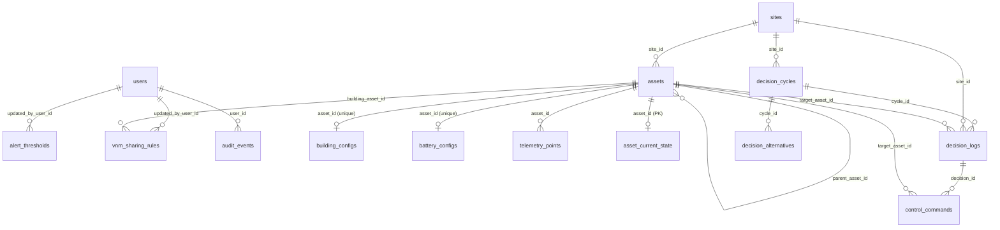

# Database

This document describes the SURYA persistence layer as implemented in `backend/models/`, `backend/db/` and the Alembic migrations in `backend/db/migrations/versions/`.

Related: [backend.md](backend.md) · [api-reference.md](api-reference.md) · [architecture.md](architecture.md)

---

## 1. Engine and connection architecture

| Aspect | Implementation | Source |
| --- | --- | --- |
| ORM | SQLAlchemy 2.0 async (`AsyncEngine`, `AsyncSession`, typed `Mapped[...]` models) | `backend/db/database.py`, `backend/models/` |
| Development / test driver | SQLite through `aiosqlite` (default `DATABASE_URL=sqlite+aiosqlite:///./surya_dev.db`) | `backend/config.py` |
| Production driver | PostgreSQL through `asyncpg` | `requirements.txt`, `render.yaml`, `docker-compose.yml` |
| URL normalisation | `postgres://` and `postgresql://` URLs are rewritten to `postgresql+asyncpg://` (Render hands out the former) | `Settings.use_async_postgres_driver` in `backend/config.py` |
| Engine options | `pool_pre_ping=True`; `check_same_thread=False` for SQLite; default SQLAlchemy pool otherwise | `get_async_engine()` |
| Sessions | `async_sessionmaker(expire_on_commit=False, autoflush=False)`; one global engine and session factory per process | `get_session_maker()` |
| Request sessions | FastAPI dependency `get_db()` yields a session, rolls back on exception, always closes | `backend/db/database.py` |
| Shutdown | `close_db()` disposes the engine in the app lifespan | `backend/main.py` |

No connection-pool sizing is configured; SQLAlchemy defaults apply.

## 2. Schema initialisation and migrations

There are two ways the schema is created, selected by `ENVIRONMENT` in the application lifespan (`backend/main.py`):

| `ENVIRONMENT` | Schema creation | Demo seed |
| --- | --- | --- |
| `development`, `test` | `Base.metadata.create_all` (`init_db()`) at startup | Always runs `seed_prestige_microgrid()` |
| anything else (`staging`, `production`) | **Not** created by the app. Run `alembic upgrade head` first. | Runs only when `SEED_DEMO_DATA=true` |

Alembic is configured by `alembic.ini` (script location `backend/db/migrations`). `backend/db/migrations/env.py` reads `DATABASE_URL` from the application settings and runs migrations with an async engine.

| Revision | File | Creates |
| --- | --- | --- |
| `001_initial_schema` | `001_initial_schema.py` | `users`, `sites`, `assets`, `building_configs`, `battery_configs`, `alert_thresholds`, `vnm_sharing_rules`, `audit_events` |
| `002_telemetry_decisions` | `002_telemetry_decisions.py` | `telemetry_points`, `asset_current_state`, `decision_cycles`, `decision_logs`, `decision_alternatives`, `control_commands` |

```bash
# Apply all migrations (uses DATABASE_URL from the environment or .env)
alembic upgrade head

# Roll back one revision
alembic downgrade -1
```

> **Note:** Because development uses `create_all`, a model change can work locally without a migration and then fail in production. Add an Alembic revision for every model change. See [contributing.md](contributing.md#adding-a-database-entity).

## 3. Entity-relationship diagram

Source: [diagrams/database-relationships.mmd](diagrams/database-relationships.mmd)



How to read it: each line is a foreign key, labelled with the referencing column. `||--o|` marks one-to-zero-or-one relationships enforced by a unique constraint (a building or battery has at most one configuration row; an asset has at most one current-state row).

## 4. Tables

All timestamps are `DateTime(timezone=True)` and are produced by `utc_now()` (`backend/models/base.py`). Tables that use `TimestampMixin` also have `created_at` and `updated_at` (application-maintained, `onupdate=utc_now`).

### 4.1 Identity and configuration

#### `users` (`backend/models/user.py`)

| Column | Type | Constraints | Purpose |
| --- | --- | --- | --- |
| `id` | Integer | PK, autoincrement | |
| `email` | String(255) | unique, indexed, not null | Login identifier. Stored lower-cased by `UserRepository.create_user`. |
| `password_hash` | String(255) | nullable | Argon2id hash. `NULL` for Google-only accounts. |
| `google_sub` | String(255) | unique, indexed, nullable | Google account subject ID. |
| `role` | Enum `UserRole` (`admin`, `operator`, `viewer`), non-native | not null, default `viewer` | Authorization role. |
| `is_active` | Boolean | not null, default true | Inactive users cannot log in or use tokens. |
| `token_version` | Integer | not null, default 1 | Incremented on logout to revoke all issued JWTs. |
| `created_at`, `updated_at` | DateTime | not null | `TimestampMixin` |

#### `sites` (`backend/models/digital_twin.py`)

| Column | Type | Constraints | Purpose |
| --- | --- | --- | --- |
| `id` | Integer | PK | The UI, mobile app and ML stream all assume site `1`. |
| `name` | String(100) | unique, not null | |
| `timezone` | String(50) | default `Asia/Kolkata` | |
| `jurisdiction` | String(50) | default `India` | |
| `currency` | String(10) | default `INR` | |
| `config_version` | Integer | default 1 | |

#### `assets`

| Column | Type | Constraints | Purpose |
| --- | --- | --- | --- |
| `id` | String(64) | PK | Human-readable slug, e.g. `solar-pv-01`. |
| `name` | String(100) | not null | |
| `asset_type` | Enum `AssetType`: `site`, `building`, `solar`, `wind`, `battery`, `load`, `grid`, `meter` | not null | |
| `site_id` | Integer | FK `sites.id` ON DELETE CASCADE | |
| `parent_asset_id` | String(64) | FK `assets.id` ON DELETE SET NULL, nullable | Self-referencing hierarchy (not used by the demo seed). |
| `rated_capacity_kw` | Float | nullable | |
| `adapter_mapping` | String(255) | nullable | Reserved for hardware adapters; not read at runtime. |
| `is_active` | Boolean | default true | Inactive assets are excluded by `TwinRepository.get_site_assets`. |

#### `building_configs` (`backend/models/config.py`)

| Column | Type | Constraints | Purpose |
| --- | --- | --- | --- |
| `id` | Integer | PK | |
| `asset_id` | String(64) | FK `assets.id` CASCADE, **unique** | One config per building. |
| `building_name` | String(100) | not null | |
| `criticality_tier` | Enum `critical`, `essential`, `non_critical` | default `essential` | Used for shedding priority by the reliability guard. |
| `flexible_load_policy` | String(50) | nullable, default `protected` | Free text, e.g. `shiftable_hvac`, `uninterruptible`. |
| `peak_load_kw` | Float | default 100.0 | |
| `operational_metadata` | JSON | nullable | |

#### `battery_configs`

| Column | Type | Default | Purpose |
| --- | --- | --- | --- |
| `asset_id` | String(64), FK `assets.id`, unique | | One config per battery. |
| `min_soc` / `max_soc` | Float | 10.0 / 95.0 | Hard SoC window (%). |
| `reserve_floor` | Float | 20.0 | SoC below which discharge is reserved for emergencies. |
| `max_charge_power_kw` / `max_discharge_power_kw` | Float | 200.0 / 200.0 | |
| `round_trip_efficiency` | Float | 0.92 | |
| `health_floor` | Float | 70.0 | Minimum state of health (%). |

#### `alert_thresholds`

`metric_name` (String(64), unique), `threshold_value` (Float), `unit` (String(20)), `severity` (Enum `critical`/`warning`/`info`), `is_active`, `updated_by_user_id` (FK `users.id` SET NULL).

> Alert thresholds are stored and editable through the API, but **no backend code evaluates them** to raise alerts. The demo seed (`seed_demo_data.py`) does not create any threshold rows; only the standalone script `backend/scripts/seed_dev.py` does.

#### `vnm_sharing_rules`

`building_asset_id` (FK `assets.id` CASCADE), `sharing_ratio` (Float; API validates 0–1), `rule_version` (incremented when the ratio changes), `jurisdiction` (default `IN-KA`), `effective_from`, `effective_until`, `updated_by_user_id`.

#### `audit_events`

Append-only by convention (no update or delete route exists; nothing in the database prevents it). Columns: `event_type` (indexed), `user_id` (FK SET NULL), `actor` (email), `action`, `resource_type`, `resource_id`, `details` (JSON), `created_at`. Written by the settings routes, emergency stop and command acknowledgement.

### 4.2 Telemetry (`backend/models/telemetry.py`)

#### `telemetry_points` — time-series history

| Column | Type | Notes |
| --- | --- | --- |
| `id` | Integer PK | |
| `asset_id` | String(64), FK `assets.id` CASCADE, indexed | |
| `metric_name` | String(64), indexed | The ML stream writes `active_power_kw` only. |
| `value` | Float, nullable | |
| `unit` | String(20) | |
| `quality` | Enum `good`, `suspect`, `stale`, `missing`, `invalid` | |
| `observed_at` | DateTime, indexed | |
| `received_at` | DateTime | |
| `source_adapter` | String(100), default `rest` | |
| `diagnostic_code` | String(50), nullable | |

Composite index: `ix_telemetry_asset_metric_observed (asset_id, metric_name, observed_at)`, which serves `GET /api/v1/telemetry/series`.

#### `asset_current_state` — latest value per asset

Primary key is `asset_id` (FK `assets.id`). Columns: `operational_status` (String(30): `online`, `degraded`, `stale`, `offline`), `active_power_kw`, `energy_kwh`, `soc_percent`, `health_percent`, `temperature_celsius`, `wind_speed_ms`, `voltage_v`, `frequency_hz`, `telemetry_quality`, `observed_at`, `received_at`, `raw_metrics` (JSON). This is the table the Digital Twin endpoints read.

### 4.3 Decisions (`backend/models/decision_log.py`)

| Table | Key columns | Notes |
| --- | --- | --- |
| `decision_cycles` | `id` (UUID string), `site_id` (FK, indexed), `status` (`started`, `completed`, `degraded`, `blocked`, `failed`), `input_snapshot_hash`, `cycle_started_at` (indexed), `cycle_completed_at`, `duration_ms`, `health_summary` (JSON), `reason` | Relationships `decisions` and `alternatives` use `lazy="selectin"`. |
| `decision_logs` | `id` (UUID), `cycle_id` (FK CASCADE, indexed), `site_id`, `target_asset_id` (FK SET NULL, indexed), `decision_type` (`dispatch`, `battery`, `vnm_allocation`, `load_shift`, `reliability`; indexed), `action`, `setpoint_kw`, `allocated_kwh`, `allocated_value_inr`, `actor` (default `system:optimizer`), `reason`, `confidence`, `expected_savings_inr`, `carbon_impact_kg`, `context_data` (JSON), `created_at` (indexed) | One row per selected decision. |
| `decision_alternatives` | `id`, `cycle_id` (FK CASCADE), `candidate_id`, `strategy_description`, `score`, `cost_component`, `carbon_component`, `is_selected`, `rejected_reason` | The scored dispatch candidates for explainability. |
| `control_commands` | `id` (UUID), `idempotency_key` (unique), `decision_id` (FK SET NULL), `target_asset_id` (FK CASCADE), `action`, `requested_setpoint`, `unit`, `status` (`pending`, `accepted`, `rejected`, `timeout`, `failed`, `executed`), `valid_from`, `valid_until`, `reason`, `originating_actor`, `adapter_response` (JSON) | Composite index `ix_control_commands_asset_status`. Commands are only created when closed-loop control is enabled **and** battery configs are passed to the cycle (see [limitations-and-roadmap.md](limitations-and-roadmap.md)). |

## 5. Enum storage (database vs. application)

All enums use `SQLEnum(..., native_enum=False)`, so they are stored as `VARCHAR`. SQLAlchemy stores the enum **member name**, not its value. Inspection of the local development database confirms this: `users.role` contains `ADMIN` and `building_configs.criticality_tier` contains `ESSENTIAL`, `CRITICAL` and `NON_CRITICAL`.

The Alembic migrations, however, declare lower-case `server_default` values (for example `role ... server_default="viewer"`, `criticality_tier ... server_default="essential"`). These defaults apply only when a row is inserted without going through the ORM, and would then produce a value the ORM cannot load. Insert rows through the ORM, or use upper-case member names in raw SQL.

## 6. Constraints: database vs. application

| Rule | Where enforced |
| --- | --- |
| Unique email, unique Google subject, unique asset config per building/battery, unique alert metric name, unique command idempotency key | Database (unique constraints / indexes) |
| Foreign keys and cascade behaviour | Database (declared in models and migrations; SQLite enforces them only if `PRAGMA foreign_keys=ON`, which the code does not set) |
| Email format, password length 8–128 | Pydantic (`UserSignupRequest`) |
| VNM `sharing_ratio` within 0–1 | Pydantic (`VNMSharingRuleCreate/Update`) |
| Emergency-stop reason 3–255 chars | Pydantic (`EmergencyStopRequest`) |
| Battery limits (`min_soc < max_soc`, etc.) | **Not validated** on update (`BatteryConfigUpdate` has no bounds) |
| Sum of VNM ratios ≤ 1 | Checked only inside `VNMOptimizer.validate_rules` at optimisation time, not on write |
| `COST_WEIGHT + CARBON_WEIGHT = 1` | Validated at startup (`Settings`), **not** when changed via `PUT /api/v1/settings/control-policy` |

## 7. Seed data

`seed_prestige_microgrid()` in `backend/db/seed_demo_data.py` is idempotent (it checks before inserting) and creates:

- Two admin demo accounts (credentials are hard-coded in the file; see [security.md](security.md#findings)).
- Site `1`: "Prestige University, Indore (Malwa Microgrid)".
- Nine assets: `solar-pv-01` (180 kW), `solar-pv-02` (120 kW), `wind-wt-01` (120 kW), `bess-unit-01` and `bess-unit-02` (125 kW each), `bldg-eng`, `bldg-admin`, `bldg-hostel`, `grid-mppkvvcl-01`.
- Building configs (Engineering = essential/shiftable HVAC, Administration = critical/uninterruptible, Hostels = non-critical/shiftable water heating), battery configs, VNM sharing rules, initial current-state rows and a few telemetry points.

`backend/scripts/seed_dev.py` is a separate, older script that **drops and recreates** the schema and seeds a different data set including alert thresholds. It is not called by the application. Run it only against a disposable database.

## 8. Data access patterns

- **Repositories:** `UserRepository`, `TwinRepository` and `DecisionRepository` in `backend/db/repositories/` wrap common queries. Many routes also query models directly with `select(...)`.
- **Hot paths:**
  - The ML fluctuation stream (every 3 s) updates every `asset_current_state` row and inserts one `telemetry_points` row per asset.
  - The decision scheduler (every `DECISION_CYCLE_SECONDS`, default 10 s) inserts a cycle, its decisions and its alternatives.
  - The ML stream also runs a decision cycle every eighth step (about every 24 s).
- **Aggregation:** `DecisionRepository.get_decision_stats` groups `decision_logs` by `decision_type` and sums `allocated_kwh`, `expected_savings_inr` and `carbon_impact_kg`.
- **N+1 pattern:** `GET /api/v1/twin/buildings` and `GET /api/v1/twin/assets` query `asset_current_state` once per asset. This is acceptable for the 9-asset demo site.

## 9. Transactions

- Request handlers commit explicitly (`await session.commit()`).
- The scheduler wraps each cycle in `session.begin()` (`backend/services/scheduler.py`).
- `get_db()` rolls back on an unhandled exception.

## 10. Retention, growth, backup

- `TELEMETRY_RETENTION_DAYS` and `DECISION_AUDIT_RETENTION_DAYS` exist in `Settings` but **no code purges data**. With the defaults, the tables grow without bound: roughly 9 telemetry rows every 3 s, plus one cycle and about 5 rows every 10 s from the scheduler.
- No backup tooling is in the repository. On Render, backups depend on the database plan; the blueprint uses the `free` plan. Free Render Postgres instances expire; check Render's current policy.
- `surya_dev.db` (the local SQLite database) is git-ignored. Delete it to reset local state; it is recreated and reseeded at the next development startup.
