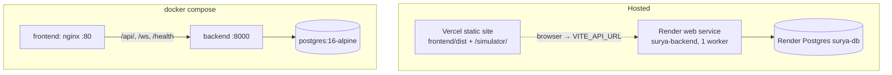

# Deployment

The repository contains configuration for two deployment topologies:

1. **Hosted:** Render for the backend and Postgres (`render.yaml`), Vercel for the web console and simulator (`vercel.json`).
2. **Self-hosted:** Docker Compose with nginx, the backend and Postgres (`docker-compose.yml`, `backend/Dockerfile`, `frontend/Dockerfile`, `nginx/nginx.conf`).

The mobile app is distributed as an APK; see [mobile-app.md](mobile-app.md).

There is **no CI/CD pipeline** in the repository (no `.github/workflows`). Deployments rely on each platform's Git integration or manual action.

Related: [environment-configuration.md](environment-configuration.md) · [architecture.md](architecture.md#10-deployment-topology) · [troubleshooting.md](troubleshooting.md)

---

## 1. Topology

Source: [diagrams/deployment-architecture.mmd](diagrams/deployment-architecture.mmd)



In the hosted topology the browser talks to Render directly. The console finds the backend through the build-time `VITE_API_URL`, and the backend must list the Vercel origin in `CORS_ORIGINS`. In the Compose topology nginx serves the SPA and proxies `/api/`, `/ws` and `/health` to the backend on the same origin, so no CORS setup is needed.

Live URLs: `render.yaml` and the backend's root page refer to `https://surya-sim.vercel.app` and `https://agnitia-hack-it.vercel.app` as console origins. **This audit did not verify that these deployments are currently live**, and it did not find the Render backend's URL in the repository.

## 2. Backend on Render (`render.yaml`)

| Setting | Value |
| --- | --- |
| Database | `surya-db`, plan `free`, region `singapore`, database `surya`, user `surya` |
| Service | `surya-backend`, `runtime: python`, plan `free`, region `singapore` |
| Root directory | Repository root (not set, so the default applies) |
| Build | `pip install -r requirements.txt` |
| Start | `alembic upgrade head && uvicorn backend.main:app --host 0.0.0.0 --port $PORT --proxy-headers --forwarded-allow-ips="*"` |
| Health check | `/health` |
| Environment | `PYTHON_VERSION=3.12.8`, `ENVIRONMENT=production`, `DATABASE_URL` (from the database), `JWT_SECRET_KEY` (generated by Render), `CORS_ORIGINS`, `SEED_DEMO_DATA=true`, `GOOGLE_CLIENT_ID` |

To reproduce:

1. In Render, choose **New → Blueprint** and select the repository.
2. Review the environment variables:
   - Set `CORS_ORIGINS` to your console URL(s).
   - Set `GOOGLE_CLIENT_ID` to your own OAuth client, or remove it.
   - **Set `SEED_DEMO_DATA` to `false` for anything beyond a throwaway demo** (see [security S1](security.md#findings)).
3. Deploy. Migrations run on every start.

Notes:

- **One worker is intentional.** The scheduler, WebSocket hub, E-stop flag and rate limiter are per-process.
- **Free-plan instances sleep when idle.** Background loops stop and the first request is slow.
- **ML models are not deployed.** The forecaster runs with dummy models and generated metrics ([ml-and-forecasting.md](ml-and-forecasting.md)).
- **Database growth:** about 9 telemetry rows every 3 s with no retention job ([database.md §10](database.md#10-retention-growth-backup)).

## 3. Web console on Vercel (`vercel.json`)

| Setting | Value |
| --- | --- |
| Framework | none (`"framework": null`) |
| Install | `cd frontend && npm ci && cd ../simulator && npm ci` |
| Build | `cd frontend && npm run build:simulator && npm run build` |
| Output directory | `frontend/dist` |
| Rewrites | `/(.*)` → `/index.html` (SPA) |
| Headers | `Cache-Control: public, max-age=31536000, immutable` on `/assets/*` and `/simulator/assets/*` |
| `.vercelignore` | Excludes backend, mobile, training, tests, docs, nginx, virtualenvs, build outputs, `*.db`, `.env` |

Project environment variables (build time):

- `VITE_API_URL`: the Render backend URL, e.g. `https://<service>.onrender.com`.
- `VITE_GOOGLE_CLIENT_ID`: optional; must match the backend's value.

Known issue: the Forecast and Overview pages call `/api/v1/forecast/48h` with a relative URL. On Vercel that request hits the SPA rewrite instead of the backend, so the Forecast page shows client-side fallback data ([frontend.md §8](frontend.md#8-known-defects)).

## 4. Docker Compose

```bash
# Set real secrets first: POSTGRES_PASSWORD, JWT_SECRET_KEY (export them or put them in a root .env read by Compose)
docker compose up --build -d
```

| Service | Image / build | Ports | Notes |
| --- | --- | --- | --- |
| `postgres` | `postgres:16-alpine` | internal | Volume `surya_pgdata`; health check `pg_isready` |
| `backend` | `backend/Dockerfile` (python:3.11-slim, non-root) | `8000:8000` | `ENVIRONMENT=production`; entrypoint runs `alembic upgrade head` (failure only warns), then `uvicorn --workers ${WORKERS:-4}`. Health check: `curl /health`. |
| `frontend` | `frontend/Dockerfile` (simulator build → app build → `nginx:alpine`) | `80:80` | nginx: `/api/` (120 s timeout), `/ws` (upgrade, 86400 s), `/health` → backend; SPA fallback; security headers; gzip |

**Known problems with this configuration** (found by reading the files; the stack was **not** started during the audit):

1. **The backend image does not copy `training/`**, but `backend/api/routes_forecast.py` imports `training.step5_test_and_train_custom_region` at module level. The container is expected to fail at import with `ModuleNotFoundError: No module named 'training'`. Fix: add `COPY training /app/training` to `backend/Dockerfile`.
2. **Four workers by default.** Set `WORKERS=1` in the backend environment.
3. **No demo seed:** `ENVIRONMENT=production` without `SEED_DEMO_DATA=true` gives an empty database (no site 1), so the twin endpoints return 404 or empty data.
4. Insecure fallback secrets are built into `docker-compose.yml` ([security S10](security.md#findings)).
5. nginx does not proxy `/docs`, `/redoc` or `/openapi.json`. Use `http://localhost:8000/docs` directly.
6. `CORS_ORIGINS` is given as a JSON array string. This form is accepted; it was verified locally that `Settings` parses it into a list.

## 5. Production checklist

- [ ] `ENVIRONMENT=production`, a strong `JWT_SECRET_KEY`, and explicit `CORS_ORIGINS`.
- [ ] `alembic upgrade head` has run against the production database.
- [ ] Exactly **one** backend worker and instance.
- [ ] `SEED_DEMO_DATA=false`, or the demo account passwords have been changed.
- [ ] Unauthenticated ML and forecast routes protected or accepted as a risk ([security S2/S3](security.md#findings)).
- [ ] The console's `VITE_API_URL` points at the backend; rebuild after changing it.

## 6. Verification after deploying

```bash
curl https://<backend>/health              # {"status":"ok",...}
curl https://<backend>/health/ready        # database healthy
curl https://<backend>/health/scheduler    # is_running true, consecutive_failures 0
curl -H "Accept: application/json" https://<backend>/
```

Then sign in on the console and confirm that the header shows the WebSocket as **Live** and that Overview values change every few seconds.

## 7. Logging and monitoring

- Logs are JSON lines on stdout; view them in the Render dashboard or with `docker logs surya_backend`.
- There is no metrics endpoint, alerting or APM integration.
- `/health/scheduler` is the most useful operational probe.

## 8. Rollback

- **Render and Vercel:** redeploy a previous deployment from the dashboard.
- **Database:** migrations have `downgrade()` functions (`alembic downgrade -1`), but rolling the application back does **not** roll back the schema. With only two migrations, the schema is stable.
- **Data:** take a database backup before risky changes; no backup tooling is included in the repository.
