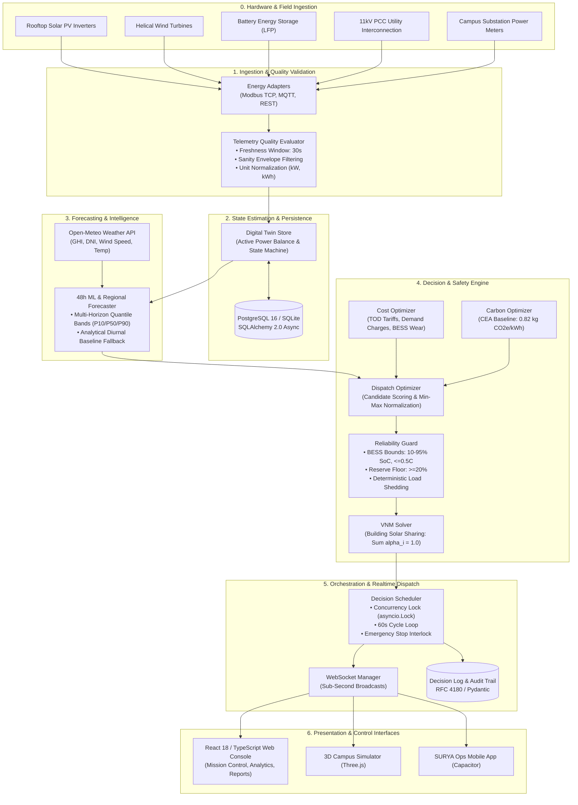

> **Legacy document.** Superseded by the code-verified documentation in [`docs/README.md`](../README.md). Kept for historical reference.

# SURYA Platform Technical Architecture

> **Smart Unified Renewable Yield Automation (SURYA)**  
> System Engineering, Mathematical Models, Data Pipelines, and Failure Recovery

---

## 1. High-Level System Architecture

SURYA is constructed around an event-driven, decoupled microgrid operations pipeline. Telemetry ingested from field sensors and power gateways flows through validation and digital twin stores before entering the mathematical optimization and safety dispatch stages.



---

## 2. End-to-End Data Pipeline

```
Field Hardware
     │  (Modbus / MQTT / REST)
     ▼
Telemetry Quality Evaluator ──► Flags: good, suspect, stale (>30s), missing, invalid
     │
     ▼
Digital Twin Store ───────────► Computes aggregate balance: P_solar + P_wind + P_bess + P_grid = P_load
     │
     ▼
48h ML Forecaster ────────────► Open-Meteo live weather + Multi-horizon solar/wind/demand profiles
     │
     ▼
Dispatch Optimizer ───────────► Generates candidates, balances TOD tariffs & CEA carbon factor
     │
     ▼
Reliability Guard ────────────► Hard safety filters: <=0.5C C-rate, SoC bounds, reserve floor (>=20%)
     │
     ▼
VNM Sharing Solver ───────────► Allocates clean kWh across campus buildings (Sum alpha_i = 1.0)
     │
     ▼
Decision Scheduler ───────────► Concurrency lock check, audit persistence, fail-safe setpoint freeze
     │
     ▼
WebSocket Manager ────────────► Non-blocking broadcast of twin_update, full_cycle, alert
     │
     ▼
Operations Console & Mobile ──► Real-time UI updates, interactive charts, and push alerts
```

---

## 3. Mathematical Optimization Formulation

All dispatch calculations are implemented in pure Python services (`backend/services/cost_optimizer.py`, `backend/services/carbon_optimizer.py`, `backend/services/dispatch_optimizer.py`).

### 3.1 Objective Function & Candidate Scoring

SURYA evaluates competing dispatch strategies by scalarizing monetary cost against operational greenhouse gas emissions:

$$\min_{c \in \mathcal{C}} \quad \text{Score}(c) = w_{\text{cost}} \cdot \overline{C}(c) + w_{\text{carbon}} \cdot \overline{E}(c)$$

Subject to:
$$w_{\text{cost}} + w_{\text{carbon}} = 1.0, \quad w_{\text{cost}}, w_{\text{carbon}} \ge 0$$

Where $\overline{C}(c)$ and $\overline{E}(c)$ are min-max normalized across all candidate strategies evaluated within the cycle:

$$\overline{C}(c) = \frac{C(c) - \min_{k} C(k)}{\max_{k} C(k) - \min_{k} C(k) + \epsilon}$$

$$\overline{E}(c) = \frac{E(c) - \min_{k} E(k)}{\max_{k} E(k) - \min_{k} E(k) + \epsilon}$$

*Note: If all candidates have identical metrics ($\max = \min$), the normalized score defaults to $0.0$.*

### 3.2 Deterministic Tie-Breakers
If two candidate strategies produce identical weighted scores, selection order is strictly deterministic:
1. **Highest Reliability Reserve Margin** ($\text{Margin}_{\text{reserve}}$ in kW)
2. **Lowest Absolute Carbon Emissions** ($E$ in kg)
3. **Lowest Monetary Cost** ($C$ in INR)
4. **Lexicographical Strategy ID** (deterministic tie-break)

### 3.3 Financial Cost Formulation (`CostOptimizer`)

Net cost over evaluation interval $\Delta t$:

$$\text{Net Cost (INR)} = \text{Import Cost} + \text{Battery Wear} + \text{Demand Charge} - \text{Export Credit}$$

Where:
- **Import Cost**:
  $$\text{Cost}_{\text{import}} = \max(0, E_{\text{grid, import}}) \times \tau_{\text{import}}$$
  *(Peak TOD Tariff up to ₹11.50/kWh, Off-Peak ₹6.50/kWh, Standard ₹8.50/kWh)*
- **Export Credit**:
  $$\text{Credit}_{\text{export}} = \max(0, E_{\text{grid, export}}) \times \tau_{\text{export}}$$
  *(Feed-in Tariff = ₹3.50/kWh)*
- **Battery Degradation Wear**:
  $$\text{Cost}_{\text{wear}} = |E_{\text{battery}}| \times \kappa_{\text{degradation}}$$
  *(Amortized cell replacement cost = ₹0.80/kWh throughput)*
- **Peak Demand Charge**:
  $$\text{Charge}_{\text{demand}} = \max(0, P_{\text{peak}} - P_{\text{contract}}) \times \rho_{\text{demand}}$$
  *(Contract Threshold = $500\text{ kW}$, Penalty Rate = ₹$250\text{/kW}$ excess)*

### 3.4 Operational Carbon Accounting (`CarbonOptimizer`)

Carbon emissions are calculated according to Indian Central Electricity Authority (CEA) standard grid intensity factors:

$$\text{Gross Carbon (kg CO}_2\text{e)} = \max(0, E_{\text{grid, import}}) \times \text{GEF}$$

$$\text{Avoided Carbon (kg CO}_2\text{e)} = \max(0, E_{\text{renewable, used}}) \times \text{GEF}$$

Where:
- $\text{GEF} = 0.82\text{ kg CO}_2\text{e/kWh}$ (CEA National Average baseline, configurable up to regional parameters).

---

## 4. Reliability & Battery Safety Guardrails

All mathematical candidates from the optimization stage pass through `ReliabilityGuard` before setpoint dispatch. **Reliability constraints unconditionally override economic objectives.**

### 4.1 BESS Physical Safety Boundaries

The battery storage system is protected by hard non-violable envelopes:

$$SoC_{\text{min}} \le SoC_{\text{reserve}} \le SoC(t) \le SoC_{\text{max}}$$

| Parameter | Guardrail Value | Engineering Purpose |
| :--- | :--- | :--- |
| **Minimum State of Charge ($SoC_{\text{min}}$)** | $10.0\%$ | Prevents deep discharge copper shunting and cell damage. |
| **Emergency Reserve Floor ($SoC_{\text{reserve}}$)** | $20.0\%$ | Locked reserve dedicated strictly to Tier 1 critical loads. |
| **Maximum State of Charge ($SoC_{\text{max}}$)** | $95.0\%$ | Protects against over-voltage and electrolyte oxidation. |
| **Maximum C-Rate ($\text{C}_{\text{rate}}$)** | $\le 0.5\text{C}$ | Restricts continuous charge/discharge to $0.5 \times \text{Capacity}$ ($200\text{ kW}$ for a $500\text{ kWh}$ pack) to preserve cycle life. |
| **Thermal Derating** | Derated if $T > 45^\circ\text{C}$ | Discharge halted completely if temperature exceeds $55^\circ\text{C}$. |

### 4.2 Deterministic Load Shedding Hierarchy

If total available supply ($P_{\text{solar}} + P_{\text{wind}} + P_{\text{bess, usable}} + P_{\text{grid}}$) cannot satisfy total demand, `ReliabilityGuard` executes deterministic load shedding in ranked order:

1. **Tier 3 (Non-Critical)**: Sports complexes, streetlights, general air conditioning. Flexible loads are curtailed first, sorted by highest wattage.
2. **Tier 2 (Essential)**: General academic classrooms, libraries, administrative offices.
3. **Tier 1 (Critical)**: Server rooms, bioscience freezers, emergency lighting. **Protected from automated shedding.**

---

## 5. Virtual Net Metering (VNM) Allocation

SURYA enforces regulatory compliance with Indian state Virtual Net Metering regulations. Solar energy credits generated at centralized campus points are distributed across independent departmental meters.

### 5.1 Conservation Law
For $N$ campus facilities, the sharing matrix must sum strictly to unity:

$$\sum_{i=1}^{N} \alpha_i = 1.000, \quad \alpha_i \ge 0$$

### 5.2 Allocation Algorithms
- **Proportional Strategy**:
  $$E_{\text{allocated}, i} = \alpha_i \times E_{\text{solar, available}}$$
- **Critical-First Strategy**:
  Allocates available clean kWh to Tier 1 Critical buildings up to their measured interval consumption, then distributes remaining solar surplus proportionally across Tier 2 and Tier 3 facilities.

---

## 6. Concurrency Control & Failure Modes

### 6.1 Concurrency Lock (`asyncio.Lock`)
To prevent overlapping optimization cycles during high database load or long network latency:
- The `DecisionScheduler` acquires `self._lock = asyncio.Lock()`.
- If an existing cycle is still processing when the 60-second timer fires, the scheduler increments `skipped_overlapping_cycles` and cleanly logs the event without blocking the event loop.

### 6.2 Emergency Stop (E-Stop) Interlock
When Emergency Stop is activated via API or UI modal:
1. `emergency_stop_active` flag is set to `True`.
2. `closed_loop_enabled` is immediately forced to `False`.
3. Inverter BESS commands are locked to `0.0 kW` (Standby).
4. Optimization runs in audit-only mode with mandatory justification logs.

### 6.3 Fail-Safe Modes

| Failure Condition | Detection Trigger | Automated System Response |
| :--- | :--- | :--- |
| **Stale Telemetry** | Age $> 30\text{s}$ | Asset tagged `stale`. Scheduler defaults to degraded safe setpoints. Automated BESS discharge blocked if $>60\text{s}$. |
| **Grid Outage** | PCC voltage/frequency drop | Islanding mode detected. Grid import set to 0. BESS switches to grid-forming frequency control. |
| **Communication Loss** | Modbus/MQTT timeout | Gateway flagged `offline`. Holds last verified safe inverter setpoints. |
| **Thermal Fault** | Battery $T > 55^\circ\text{C}$ | Inverter trips to standby. Critical alarm broadcast over WebSocket. |
