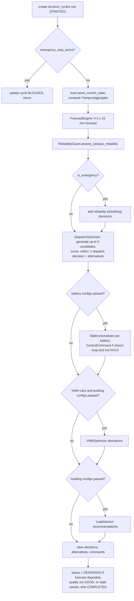

# Key Workflows and Business Logic

This document traces the main runtime workflows through the code. Read it alongside [backend.md](backend.md) for module responsibilities and [api-reference.md](api-reference.md) for the HTTP contracts.

---

## Decision cycle

Entry points:

- `DecisionScheduler._loop` (every `DECISION_CYCLE_SECONDS`, default 10 s)
- `POST /api/v1/control/force-cycle`
- `MLMicrogridSyncService.apply_ml_prediction`
- every eighth step of the ML fluctuation stream

All of them call `DecisionManager.run_decision_cycle` (`backend/services/decision_manager.py`).



> In the running application the "passed?" branches are always **no**, because no caller passes the configurations. See [backend.md §5](backend.md#5-services).

### Dispatch candidates (`DispatchOptimizer.generate_candidates`)

| ID | Name | Battery power |
| --- | --- | --- |
| `cand-01-self-cons` | Self Consumption | Charges with surplus if renewables cover demand; otherwise discharges to cover the deficit |
| `cand-02-cost-min` | Cost Minimization | Discharges up to the deficit |
| `cand-03-carbon-min` | Carbon Minimization | Discharges up to the deficit (same power as cost-min; the two differ only in label) |
| `cand-04-conservative-res` | Conservative Reserve | 0 (idle) |
| `cand-05-grid-export` | Grid Export Support | 0, added only if renewables > 0 |

For each candidate the optimiser:

1. Computes grid import and export (limits 1000 kW import, 500 kW export).
2. Computes interval cost (`CostOptimizer`) and emissions (`CarbonOptimizer`, grid factor 0.82 kg/kWh in the optimiser defaults).
3. Computes a reliability margin.

Scoring is min–max normalised:

```text
score = w_cost · norm_cost + w_carbon · norm_carbon        (lower is better)
tie-breakers: feasible first → higher reliability margin → lower carbon → lower cost → candidate ID
```

The weights come from `Settings.COST_WEIGHT` and `Settings.CARBON_WEIGHT` (0.6 / 0.4 by default) when the cycle is called by the scheduler. The decision manager's default tariffs are an import of ₹9.50/kWh and an export of ₹3.50/kWh. The scheduler does **not** pass `GRID_IMPORT_TARIFF_PER_KWH` (default 8.50), so that setting has no effect.

### Reliability guard

`calculate_battery_discharge_capacity` splits each battery's discharge into two parts:

- **Economic:** SoC above `reserve_floor`.
- **Emergency reserve:** SoC between `min_soc` and `reserve_floor`.

`assess_campus_reliability` compares demand with generation, usable battery and grid capacity. On a shortfall it produces shedding recommendations ordered non-critical → essential → critical.

## ML fluctuation stream (the source of live values)

`MLMicrogridSyncService.generate_live_fluctuation_step` (`backend/services/ml_microgrid_sync.py`) runs every 3 s, started at boot:

1. Get weather with `ml_forecaster.get_realtime_weather` (Open-Meteo; 60 s cache; offline fallback) and add small Gaussian noise to GHI, wind and temperature.
2. Compute a physics baseline:
   - **Solar:** 300 kW × GHI/1000 × 0.85, derated 0.4 %/°C above 25 °C cell temperature.
   - **Wind:** 120 kW on a cubic-like curve with cut-in 1.5 m/s, rated 12 m/s and cut-out 25 m/s.
3. Get P10, P50 and P90 from `predict_realtime_point`, which uses the ML models or the dummy fallback.
4. Mean-revert the previous solar, wind and demand values towards P50 with Gaussian noise. Derive battery and grid flows, then add random voltage (415 ± 0.4 V) and frequency (50 ± 0.02 Hz).
5. Write `asset_current_state` and one `telemetry_points` row per asset, then commit.
6. Every eighth step, run a decision cycle and broadcast `full_cycle`.
7. Broadcast `twin_update` with aggregates, assets, fluctuation, weather and the physics baseline.

The values the console displays are therefore **modelled**, not measured.

## Zero-to-ML demonstration

These routes exist for demonstrating the model. The current console does not call them, except for the stream start and status calls.

1. `POST /api/v1/twin/reset-to-zero` sets every asset's power to 0.
2. `POST /api/v1/twin/apply-ml-prediction` runs the prediction and writes setpoints. Batteries are set to SoC 75 % and health 97 %. It then runs a cycle.
3. `GET /api/v1/twin/ml-comparison` shows the zero and ML values side by side.

The WebSocket broadcast at the end of step 2 references undefined variables (`solar_total`, `setpoints`, `assets`, ...). It raises `NameError`, which is caught and logged as a warning, so connected clients are not notified.

## Login and session

See [authentication-and-authorization.md](authentication-and-authorization.md).

## Emergency stop

1. An admin calls `POST /api/v1/control/emergency-stop {active: true, reason}`. The console's Settings page has the button (`EmergencyStopModal`); the mobile app's Control tab has a press-and-hold button.
2. `scheduler.set_emergency_stop(True)` runs and an audit event is written.
3. Subsequent scheduler cycles are recorded as `BLOCKED` with no decisions.

Limits:

- The flag is in memory: it is lost on restart and not shared between workers.
- The ML stream keeps updating twin values, and its periodic cycles **do not** check the flag.
- No adapter exists, so no physical setpoints are frozen.

## Settings changes and audit

Admin `PUT`/`POST` routes under `/api/v1/settings` update the row, write an `audit_events` row with the old and new values, and commit in the same transaction. There is no API to read audit events; query the table directly.

## Reports

`GET /api/v1/export/{csv|pdf|stats}` → `ExportService`. It aggregates decision logs for the period and adds data-quality disclosures. The console's download buttons currently fail; see [frontend.md](frontend.md#8-known-defects).

## Mobile alerting

The phone polls `/api/v1/twin/live`, `/decisions/latest`, `/decisions/stats` and `/settings/control-policy`, evaluates rules on the device (`mobile/src/lib/alerts.ts`) and raises local notifications. See [mobile-app.md](mobile-app.md). The backend itself raises no alerts.

## Model training (offline)

Run `training/step1` to `step6` on a workstation. They produce joblib models and metrics JSON under hard-coded `D:\` paths, which the backend loads at import time. See [ml-and-forecasting.md](ml-and-forecasting.md).
